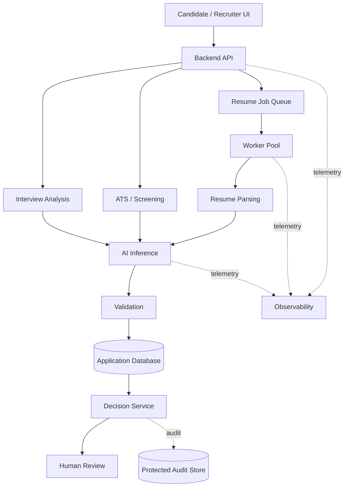
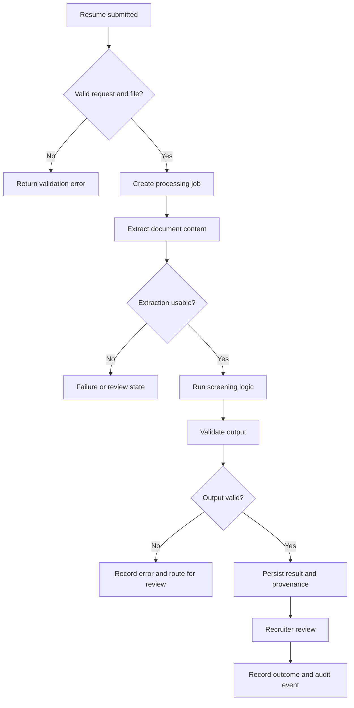
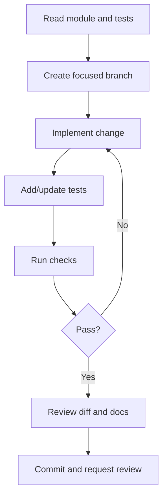

# Architecture Diagrams and Workflows

## Logical architecture

```mermaid
flowchart TD
 UI[Candidate / Recruiter UI] --> API[Backend API]
 API --> Q[Resume Job Queue]
 Q --> W[Worker Pool]
 W --> P[Resume Parsing]
 P --> AI[AI Inference]
 API --> S[ATS / Screening]
 API --> I[Interview Analysis]
 S --> AI
 I --> AI
 AI --> V[Validation]
 V --> DB[(Application Database)]
 DB --> D[Decision Service]
 D --> H[Human Review]
 API -. telemetry .-> O[Observability]
 W -. telemetry .-> O
 AI -. telemetry .-> O
 D -. audit .-> A[(Protected Audit Store)]
```

## Resume workflow

```mermaid
flowchart TD
 A[Resume submitted] --> B{Valid request and file?}
 B -- No --> C[Return validation error]
 B -- Yes --> D[Create processing job]
 D --> E[Extract document content]
 E --> F{Extraction usable?}
 F -- No --> G[Failure or review state]
 F -- Yes --> H[Run screening logic]
 H --> I[Validate output]
 I --> J{Output valid?}
 J -- No --> K[Record error and route for review]
 J -- Yes --> L[Persist result and provenance]
 L --> M[Recruiter review]
 M --> N[Record outcome and audit event]
```

## Developer workflow

```mermaid
flowchart TD
 A[Read module and tests] --> B[Create focused branch]
 B --> C[Implement change]
 C --> D[Add/update tests]
 D --> E[Run checks]
 E --> F{Pass?}
 F -- No --> C
 F -- Yes --> G[Review diff and docs]
 G --> H[Commit and request review]
```
